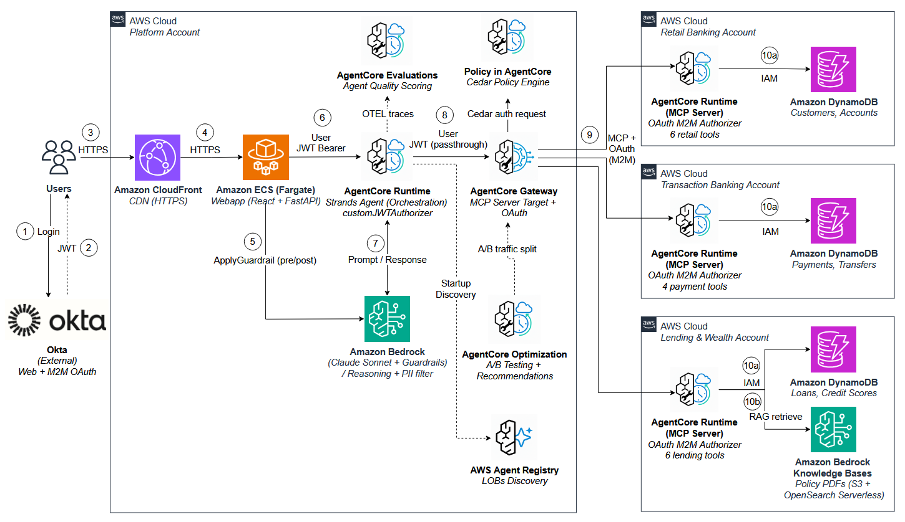

# 🏦 Multi-Account Banking Agent — Centralized Agent, Distributed MCP Servers

## Overview

Cross-account tool federation using Amazon Bedrock AgentCore. A single AI agent in a central platform account discovers and invokes **16 banking tools** federated across **3 line-of-business (LOB) AWS accounts** — combining DynamoDB queries with Bedrock Knowledge Base RAG over policy PDFs — with user identity propagation (JWT flows to Gateway for Cedar per-user auth), OAuth M2M for cross-account LOB calls, dynamic tool discovery via Agent Registry, and a React webapp with real-time agent trace visualization.

This pattern demonstrates **one agent orchestrating tools across organizational boundaries** without requiring cross-account IAM roles. Each LOB retains full data sovereignty — their DynamoDB tables, S3 documents, and Knowledge Bases never leave their account. The agent discovers LOB capabilities at startup via Agent Registry (`search_registry_records()`), then invokes tools through AgentCore Gateway using the user's JWT (for Cedar per-user authorization), with the Gateway routing each call to the owning LOB by its tool-name prefix (`{lob-name}___{tool-name}`).

The result is a composable, team-independent architecture: when a new LOB onboards, they deploy their MCP server, register in the Agent Registry, and the agent discovers them automatically — no agent redeployment needed.

> **⚠️ Disclaimer:** Proof-of-concept demo — NOT for production use. All customer data is synthetic. See [Production Considerations](#production-considerations) for hardening guidance.

## Architecture

**One agent, three LOB accounts, one Gateway, one Registry:**
- **Platform Account** — Strands Agent + AgentCore Gateway + Agent Registry + React webapp
- **Retail Banking** → 6 tools (customer profiles, accounts, balances, balance updates, delete_customer†)
- **Transaction Banking** → 4 tools (payments, transfers, beneficiaries)
- **Lending & Wealth** → 6 tools (loans, credit scores, EMI + KB policy search)



## Getting Started

```bash
git clone https://github.com/aws-samples/sample-amazon-bedrock-agentcore-banking-mcp-multi-account.git
cd sample-amazon-bedrock-agentcore-banking-mcp-multi-account
```

> No manual install needed — `deploy.sh` handles everything: Python virtual environments, CDK bootstrap, infrastructure deployment, agent deployment, and webapp deployment.
>
> **No local virtual environment required.** The CDK venvs are created automatically by `deploy.sh` (Step 1) inside `infra/platform/.venv/` and `infra/lob/.venv/`. The agent and MCP server code never runs locally — it's packaged and deployed directly to AgentCore Runtime via `agentcore deploy`.

## Prerequisites

- **4 AWS accounts** (1 platform + 3 LOB) with CLI profiles configured
- AWS CLI v2 + configured profiles: `platform`, `retail-banking`, `transaction-banking`, `lending-wealth`
- Python 3.12+, Docker, Node.js 18+
- [CDK CLI](https://docs.aws.amazon.com/cdk/v2/guide/getting-started.html) v2.116+ (`npm install -g aws-cdk`)
- [AgentCore CLI](https://aws.github.io/bedrock-agentcore-starter-toolkit/) (`pip install bedrock-agentcore-starter-toolkit`)
- Bedrock model access: Claude Sonnet 4.5 enabled in us-east-1
- **Okta developer account** with an authorization server configured (see below)

## Okta Setup (One-Time)

Create the following in your Okta admin console before running `deploy.sh`:

1. **Custom Authorization Server**
   - Name: `LOB Federation` (or any name)
   - Audience: `lobfederation`
   - Custom scope: `lobfederation.invoke` (add under Scopes tab)
   - **Access Policy**: Add a rule (or edit the default) with:
     - Grant types: ✅ Authorization Code, ✅ Client Credentials
     - Scopes: "Any scopes" (or explicitly `lobfederation.invoke`, `openid`, `profile`, `email`)
     - Assigned clients: "All clients" (or explicitly both Web + M2M apps)

2. **Web Confidential App** (for user login)
   - Application type: Web
   - Grant types: Authorization Code
   - Sign-in redirect URI: `http://localhost:8000/api/callback` (update post-deploy with CloudFront URL)
   - Sign-out redirect URI: `http://localhost:3000` (update post-deploy with CloudFront URL)

3. **M2M Confidential App** (for Gateway → LOB cross-account auth)
   - Application type: API Services (Machine-to-Machine)
   - Grant types: Client Credentials
   - Assign to the custom authorization server with scope `lobfederation.invoke`

4. **Create a demo user** (Okta doesn't allow self-registration by default)
   ```bash
   # Requires OKTA_API_TOKEN env var (Admin → Security → API → Tokens → Create Token)
   OKTA_API_TOKEN=<your-token> ./scripts/create_user.sh banker@example.com "Banking@Demo2026"
   ```
   Or create manually in Okta Admin → Directory → People → Add Person (set password, no email verification).

5. **Create `okta_config.json`** in the project root:
   ```json
   {
     "okta_org": "https://your-org.okta.com",
     "issuer": "https://your-org.okta.com/oauth2/<auth-server-id>",
     "discovery_url": "https://your-org.okta.com/oauth2/<auth-server-id>/.well-known/openid-configuration",
     "token_endpoint": "https://your-org.okta.com/oauth2/<auth-server-id>/v1/token",
     "web_client_id": "<web-app-client-id>",
     "web_client_secret": "<web-app-client-secret>",
     "m2m_client_id": "<m2m-app-client-id>",
     "m2m_client_secret": "<m2m-app-client-secret>",
     "audience": "lobfederation",
     "scope": "lobfederation.invoke",
     "custom_scope": "lobfederation.invoke"
   }
   ```

> `okta_config.json` is gitignored. Each developer creates their own from their Okta org.

## Account Setup

This demo uses **4 AWS accounts** mapped to logical profile names. You can use any accounts — just create one CLI profile per account.

Configure each profile with `aws configure` (SSO, access keys, or role assumption — any method works). A single `aws configure --profile <name>` creates that profile in **both** `~/.aws/config` and `~/.aws/credentials`. **When prompted for the region, enter `us-east-1`** (required for Bedrock model access):

```bash
aws configure --profile platform
aws configure --profile retail-banking
aws configure --profile transaction-banking
aws configure --profile lending-wealth
```

After configuring, your `~/.aws/config` will look like this — one `[profile …]` block per account:

```bash
# ~/.aws/config — each profile maps to one of your 4 accounts.
# NOTE: the account IDs below are informational only, NOT config keys.
# Each profile's account is determined by its credentials (set via
# `aws configure` above); deploy.sh auto-detects the IDs via
# `aws sts get-caller-identity`.
[profile platform]
# account: 111111111111  ← your shared-services account
region = us-east-1

[profile retail-banking]
# account: 222222222222  ← any account for retail banking LOB
region = us-east-1

[profile transaction-banking]
# account: 333333333333  ← any account for transaction banking LOB
region = us-east-1

[profile lending-wealth]
# account: 444444444444  ← any account for lending & wealth LOB
region = us-east-1
```

That's it. `deploy.sh` auto-detects account IDs from these profiles at runtime and writes your platform account ID to `infra/lob/cdk.context.json` (gitignored) for cross-account trust. No other manual edits needed.

## Deployment

> ⏱️ Full deployment takes ~25–35 minutes (OpenSearch Serverless collection + 4 AgentCore Runtime deployments).

```bash
./deploy.sh
```

### Deploy Options

| Command | When to use |
|---------|-------------|
| `./deploy.sh` | **First-time / full deploy.** Runs all 12 steps: validate, venv, CDK bootstrap, platform infra, LOB infra, seed data, generate PDFs, deploy MCP servers, create Gateway targets, register in Agent Registry, deploy agent, deploy webapp. |
| `./deploy.sh --from 7` | **Resume after failure.** Skips steps 0–6, starts from MCP server deployment. Use when CDK succeeded but agent deployment failed. |
| `./deploy.sh --from 11` | **Redeploy webapp only.** Useful after frontend/backend code changes. |

### Post-Deploy: Okta Redirect URIs (one-time)

After the first deploy completes, copy the CloudFront URL from the output and update your Okta Web app (`LOB Federation Banking - Web`):

1. **Sign-in redirect URI:** `https://<cloudfront-domain>/api/callback`
2. **Sign-out redirect URI:** `https://<cloudfront-domain>`

This is required because the CloudFront domain is generated at deploy time and cannot be known in advance.

<details>
<summary>Deploy Steps (click to expand)</summary>

| Step | What it does |
|------|-------------|
| 0 | Validate prerequisites (AWS CLI, CDK, profiles, model access) |
| 1 | Python venv + CDK dependencies |
| 2 | CDK bootstrap (platform + 3 LOB accounts) |
| 3 | CDK deploy — platform infra (Foundation, Guardrail, Gateway) |
| 4 | CDK deploy — LOB infra (DynamoDB, IAM roles, KB for lending-wealth) |
| 5 | Seed DynamoDB tables (3 LOBs) |
| 6 | Generate + upload banking policy PDFs to lending-wealth S3 |
| 7 | Deploy 3 LOB MCP servers (`agentcore deploy` × 3) |
| 8 | Create Gateway targets + OAuth credential provider + Cedar policies |
| 9 | Register 3 LOBs in Agent Registry |
| 10 | Deploy agent (`agentcore deploy`) |
| 11 | CDK deploy — webapp + CloudFront |

</details>

## Demo Scenarios

| # | Scenario | LOBs Called | Try This |
|---|----------|-------------|----------|
| 1 | Payments & Balances | Retail + Transaction | "Pull recent payments and balances for James Wilson" |
| 2 | Client Meeting Prep | All 3 | "Give me a complete relationship summary for Priya Sharma" |
| 3 | Fund Transfer ✍️ | Retail + Transaction | "Transfer $500 from Priya's savings to her checking account" |
| 4 | Loan Pre-Qualification ⭐ | All 3 + KB | "Is Maria Garcia eligible for a $50K personal loan?" |
| 5 | Portfolio Risk Snapshot | All 3 (multi-customer) | "Compare C001, C002, C003 — balances, credit scores, loans" |
| 6 | PII Redaction | Guardrail | "My SSN is 123-45-6789. What is my credit score?" |
| 7 | Cedar Policy Denial 🚫 | Blocked by Gateway | "Delete customer Priya Sharma from the system" |

**Test customers:** C001 (Priya Sharma, Premium), C002 (James Wilson, Standard), C003 (Maria Garcia, Premium)

**Write operations:** Scenario 3 demonstrates that the agent isn't read-only — it performs cross-account writes (`transfer_funds` + `update_balance`) across two LOB accounts in a single turn, proving the architecture supports mutating operations with the same auth chain.

**Login:** Single demo user (`banker@example.com`) with full access to all 16 tools across all LOBs — simulating a relationship manager with complete portfolio visibility.

**Trace view:** Every response shows a governance summary: Bedrock Guardrail status (passed/blocked with PII types) and Cedar Policy status (ENFORCE authorized / DENIED with tool name). The trace panel also shows which LOB tools were invoked, per-tool duration, end-to-end timing, and the cross-account auth chain.

## Cleanup

```bash
./cleanup.sh
```

Prompts once for confirmation, then destroys all resources in reverse-deploy order: agent runtime → 3 MCP servers → Gateway targets → Agent Registry → platform CDK stacks → LOB CDK stacks → local config files.

## Components & Data Flow

<details>
<summary>Click to expand</summary>

### Components

| Component | Role |
|---|---|
| CloudFront → ALB → ECS Fargate | 1 task, 2 containers: React frontend (nginx :80) + FastAPI backend (:8000). |
| Okta Authorization Server | Single auth server with two clients: (a) **Web confidential client** — auth-code for React login, access_token forwarded through agent to Gateway for per-user Cedar auth; (b) **M2M confidential client** — `client_credentials` for Gateway→LOB outbound auth only. |
| AgentCore Runtime — Agent | Hosts `lobfederation_agent` (Strands + Claude Sonnet 4.5). Discovers LOBs from Agent Registry at startup, connects to Gateway via MCP protocol. |
| AgentCore Runtime × 3 — MCP Servers | Hosts `retail_banking_mcp`, `transaction_banking_mcp`, `lending_wealth_mcp` (FastMCP, MCP protocol). Each validates inbound JWTs via `customJWTAuthorizer`. |
| Agent Registry | Central catalog of LOB MCP servers. Agent queries `search_registry_records()` at startup — no hardcoded LOB endpoints. |
| AgentCore Gateway | Routes tool calls to the correct LOB MCP server by tool-name prefix. Okta JWT inbound auth (user token, Cedar per-user), OAuth M2M outbound auth, unified exposure of all 16 tools through a single MCP endpoint. |
| Bedrock Knowledge Base | Lending policy PDFs in S3, embeddings in OpenSearch Serverless (Titan v2). Queried by `search_lending_policies` tool in lending-wealth MCP server. |
| Bedrock Guardrail | PII redaction on input and output (SSN, credit card numbers). Called by ECS backend via `ApplyGuardrail` API — independent of the agent. |
| Cedar Policy Engine | Attached to Gateway in ENFORCE mode. Permits all authenticated tool calls except `delete_customer` (denied for Scenario 7 demo). |

### Data Flow (per user question)

1. User submits prompt → backend `/api/chat` (cookie session, verified server-side).
2. Backend applies Bedrock Guardrail to input (PII check).
3. Backend invokes Agent Runtime via HTTPS with Bearer token (user's access_token).
4. Agent calls `search_registry_records()` (cached after first call) to confirm LOB availability.
5. Agent reasons about which tools to call, sends MCP requests to Gateway (Bearer: user JWT).
6. Gateway routes the call to the correct LOB MCP server by tool-name prefix (Bearer: outbound M2M JWT).
7. LOB MCP server validates JWT, executes tool logic against local DynamoDB (or KB for lending policies).
8. Results flow back: LOB → Gateway → Agent → Backend.
9. Backend applies Bedrock Guardrail to output (PII check).
10. Frontend displays response + tool trace panel showing LOBs accessed with timing.

### Cross-Account Auth Chain

```
Browser → Okta JWT → CloudFront → ALB → ECS Backend
  → Bearer user JWT → Agent Runtime (customJWTAuthorizer validates)
    → user JWT forwarded → Gateway (Cedar per-user auth)
      → Okta M2M OAuth (credential provider) → LOB MCP Server (customJWTAuthorizer)
        → IAM (runtime role) → DynamoDB / Bedrock KB
```

</details>

## Key Design Decisions

<details>
<summary>Click to expand</summary>

| Decision | Approach | Rationale |
|---|---|---|
| Cross-account auth | OAuth M2M (not IAM roles) | Cross-account IAM requires dual resource-based policies (runtime + endpoint) adding deployment complexity (6 policies for 3 LOBs). OAuth M2M is simpler, consistently documented, and matches all reference implementations. User JWT propagates to Gateway for Cedar per-user auth; Gateway→LOB uses M2M. Pure IAM cross-account is supported via `PutResourcePolicy` if preferred — see [Resource-based policies docs](https://docs.aws.amazon.com/bedrock-agentcore/latest/devguide/resource-based-policies.html). |
| Tool discovery | Agent Registry (`search_registry_records`) | Agent doesn't hardcode LOB endpoints. New LOBs register and are discovered automatically. |
| Data location | Stays in LOB accounts | Data sovereignty, compliance, blast radius isolation. |
| Tool routing | AgentCore Gateway (tool-name prefix) | Single MCP endpoint exposes all 16 tools; Gateway routes each call to the owning LOB by name prefix — no manual routing logic. |
| Agent framework | Strands Agents SDK | Native MCP client support, Bedrock integration, tool tracing. |
| User auth | Okta (admin-managed, no self-registration) | Enterprise security pattern. |
| Infrastructure | CDK (2 apps: platform + reusable LOB) | Repeatable, team-independent deployment. Each LOB team runs their own CDK pipeline. |
| Hosting | ECS Fargate + CloudFront | Containerized, no server management, HTTPS at edge. |
| KB location | In lending-wealth account (not platform) | LOB owns their unstructured data. Agent never touches KB directly. |

</details>

## Production Considerations

<details>
<summary>Click to expand</summary>

| Area | Current (Demo) | Recommended |
|------|---------------|-------------|
| **HTTPS** | ✅ CloudFront HTTPS termination | ACM certificate + custom domain |
| **WAF** | None | AWS WAF on CloudFront |
| **Auth (users)** | Okta admin-managed users | Federated IdP (Okta, Azure AD) |
| **Auth (cross-account)** | OAuth M2M via Okta (single audience) | Use distinct OAuth audiences per trust boundary to prevent token lateral movement (e.g., "lobfederation-gateway" for agent→Gateway, "lobfederation-lob" for Gateway→LOB) |
| **Secrets** | AgentCore Identity Token Vault | Secrets Manager with rotation |
| **Monitoring** | CloudWatch logs | Alarms, X-Ray, AgentCore observability |
| **VPC** | Default VPC, public IPs | Private subnets, NAT Gateway, VPC endpoints |
| **Guardrail** | PII redaction only | Add topic denial, content filters |

</details>

## Project Structure

<details>
<summary>Click to expand</summary>

```
├── deploy.sh                              # Master deploy (--from N step-resume)
├── cleanup.sh                             # Reverse-order destroy
│
├── infra/
│   ├── platform/                          # CDK App 1 (platform account)
│   │   └── stacks/
│   │       ├── foundation_stack.py        # IAM roles
│   │       ├── guardrail_stack.py         # Bedrock Guardrail
│   │       ├── gateway_stack.py           # AgentCore Gateway
│   │       ├── webapp_stack.py            # ECS Fargate + ALB
│   │       └── cloudfront_stack.py        # CloudFront distribution
│   └── lob/                               # CDK App 2 (deployed 3x per LOB)
│       └── stacks/
│           ├── data_stack.py              # DynamoDB tables
│           ├── iam_stack.py               # Cross-account trust role
│           └── knowledge_base_stack.py    # KB (lending-wealth only)
│
├── platform-account/
│   ├── agent/agent.py                     # Strands agent + Registry discovery
│   └── gateway/
│       ├── setup_gateway.py               # Gateway targets + OAuth provider
│       └── register_agents.py             # Register LOBs in Agent Registry
│
├── lob-accounts/
│   ├── retail-banking/mcp_server/         # 6 tools (DynamoDB)
│   ├── transaction-banking/mcp_server/    # 4 tools (DynamoDB)
│   └── lending-wealth/
│       ├── mcp_server/                    # 6 tools (DynamoDB + KB)
│       └── documents/                     # Banking policy PDFs
│
├── platform-account/webapp/
│   ├── backend/                           # FastAPI + Okta JWT + Guardrail
│   └── frontend/                          # React + Chat UI + TracePanel
│
└── scripts/
    ├── create_user.sh                     # Create Okta demo users
    └── generate_documents.py              # Generate banking policy PDFs
```

</details>

## References

<details>
<summary>Click to expand</summary>

- [Amazon Bedrock AgentCore Documentation](https://docs.aws.amazon.com/bedrock-agentcore/latest/devguide/)
- [AgentCore Gateway — MCP Server Targets](https://docs.aws.amazon.com/bedrock-agentcore/latest/devguide/gateway-target-MCPservers.html)
- [AgentCore Agent Registry](https://docs.aws.amazon.com/bedrock-agentcore/latest/devguide/registry.html)
- [Deploy MCP Servers in AgentCore Runtime](https://docs.aws.amazon.com/bedrock-agentcore/latest/devguide/runtime-mcp.html)
- [Strands Agents — MCP Tools](https://strandsagents.com/latest/documentation/docs/user-guide/concepts/tools/mcp-tools/)
- [AgentCore Starter Toolkit](https://aws.github.io/bedrock-agentcore-starter-toolkit/)
- [AgentCore Samples Repository](https://github.com/awslabs/amazon-bedrock-agentcore-samples)

</details>

## Security

See [CONTRIBUTING](CONTRIBUTING.md#security-issue-notifications) for more information.

## License

This library is licensed under the MIT-0 License. See the [LICENSE](LICENSE) file.

## Authors

**Senthil Kamala Rathinam, Shashi Makkapati, Karthik Tharmarajan**
